# Posit Benefit Corporation

## A Message from our CEO

Posit aims to create free and open-source software for data science,
scientific research, and technical communication in a sustainable way,
because it benefits everyone when the essential tools to produce and
consume knowledge are available to all, regardless of economic means.

We believe corporations should fulfill a purposeful benefit to the
public and be run for the benefit of all stakeholders including
employees, customers, and the larger community.

As a Delaware Public Benefit Corporation (PBC) and a Certified B
Corporation®, Posit’s open-source mission and commitment to a beneficial
public purpose are codified in our charter, requiring our corporate
decisions to balance the interests of the community, customers,
employees, and shareholders.

B CorpsTM meet the highest verified standards of social and
environmental performance, transparency, and accountability. Posit
measures its public benefit by utilizing the non-profit B Lab®’s “Impact
Assessment”, a rigorous assessment of a company’s impact on its workers,
customers, community, and environment.

In 2019, Posit (then RStudio) met the B Corporation certification
requirements set by the B Lab. In 2023, our certification was renewed,
and we are proud to share that our B Lab Impact Assessment score rose
from 86.1 to 92.5 with this renewal. The B Lab certification process
uses credible, comprehensive, transparent, and independent standards to
measure social and environmental performance. Details of these
assessments can be found on our [B Lab company
page](https://www.bcorporation.net/en-us/find-a-b-corp/company/rstudio/).

To fulfill its beneficial purposes, Posit intends to remain an
independent company over the long term. With the support of our
customers, employees, and the community, we remain excited to contribute
useful solutions to the important problems of knowledge they face.

*J.J. Allaire*  
CEO, Posit PBC

## Introduction

Posit’s mission is to create free and open-source software for data
science, scientific research, and technical communication. We do this to
enhance the production and consumption of knowledge by everyone,
regardless of economic means, and to facilitate collaboration and
reproducible research, both of which are critical to the integrity and
efficacy of work in science, education, government, and industry.

In addition to our open source products, Posit produces a modular
platform of commercial software products that enable teams to adopt R,
Python, and other open-source data science software at scale. Posit also
offers online services that make it easier to learn and use data science
tools over the web.

Together, Posit’s open-source software and commercial software form a
virtuous cycle. In most companies, a “customer” is someone who pays you.
For us, the definition of a customer must include the open source
community, with whom we exchange the currencies of attention, respect,
and love. When we deliver value to our open source users, they will
likely bring our software into their professional environments, which
opens up the possibility of commercial partnerships. To keep this cycle
flowing, our open source developers must know and care about the
integrations with proprietary solutions that matter to our enterprise
customers. It also means that Posit’s commercial teams consistently
provide value to individuals who may never directly spend a dollar with
us.

Posit’s approach is not typical. Traditionally, scientific and technical
computing companies create exclusively proprietary software. While it
can provide a robust foundation for investing in product development,
proprietary software can also create excessive dependency that is not
good for data science practitioners and the community. In contrast,
Posit provides core productivity tools, packages, protocols, and file
formats as open-source software so customers aren’t overly dependent on
a single software vendor. Additionally, while our commercial products
enhance the development and use of our open-source software, they are
not fundamentally required for those without the need or the ability to
pay for them.

As of May 2024, Posit is spending ~38% of its engineering resources on
open-source software development, and is leading contributions to over
350 open-source projects. Posit-led projects targeted a broad range of
areas including the RStudio IDE; infrastructure libraries for R and
Python; numerous packages and tools to streamline data manipulation,
exploration and visualization, modeling, and machine learning; and
integration with external data sources. Posit also sponsors or
contributes to many open-source and community projects led by others,
including NumFOCUS, the R Consortium, the Python Software Foundation,
DuckDB, Pandoc, pyodide, and ProseMirror, as well as dozens of smaller
projects via the Open Source Collective or directly on Github.
Additional information about our products and company contributions for
the past two years can be found in our [“Year In Review” blog
posts](https://posit.co/blog/2023-posit-year-in-review/).

Today, millions of people download and use Posit open-source products in
their daily lives. Additionally, more than 10,000 customers that
purchase our professional products help us sustain and grow our mission.
It is inspiring to help so many people participate in global economies
that increasingly reward data literacy, and know that our tools help
produce insights essential to navigating our complex world.



## Posit’s Charter and Statement of Public Benefit

### Posit’s Charter

We want Posit to serve a meaningful public purpose, and we run the
company for the benefit of our customers, employees, and the community
at large. That’s why we’re organized as a Public Benefit Corporation
(PBC).

What makes a PBC different from other types of corporations?

> *“A ‘public benefit corporation’ is a for-profit corporation organized
> under and subject to the requirements of this chapter that is intended
> to produce a public benefit or public benefits and to operate in a
> responsible and sustainable manner.”* — [Delaware Public Benefit
> Corporations Law](https://delcode.delaware.gov/title8/c001/sc15/)

As a PBC and Certified B Corporation, we must meet the highest verified
standards of social and environmental performance, transparency, and
accountability. Our directors and officers have a fiduciary
responsibility to address social, economic, and environmental needs
while still overseeing our business goals.

### Posit’s Statement of Public Benefit

Creation of free and open source software for data science, scientific
research, and technical communication:

> 1\) To enhance the production and consumption of knowledge by
> everyone, regardless of economic means.
>
> 2\) To facilitate collaboration and reproducible research, both of
> which are critical for ensuring the integrity and efficacy of
> scientific work.



### Our primary obligations as a PBC and Certified B Corporation

#### Public Benefit Corporation

*How we built our company charter*

- The board of directors shall manage or direct the business and affairs
  of the public benefit corporation in a manner that balances the
  pecuniary interests of the stockholders, the best interests of those
  materially affected by the corporation’s conduct, and the specific
  public benefit or public benefits identified in its certificate of
  incorporation.

- A public benefit corporation shall no less than biennially provide its
  stockholders with a statement as to the corporation’s promotion of the
  public benefit or public benefits identified in the certificate of
  incorporation and of the best interests of those materially affected
  by the corporation’s conduct.

#### Certified B Corp

*How we hold ourselves accountable to our charter*

- Demonstrate high social and environmental performance by achieving a B
  Lab Impact Assessment score of 80 or above and passing the risk
  review.

- Make a legal commitment by changing our corporate governance structure
  to be accountable to all stakeholders, not just shareholders, and
  achieve benefit corporation status if available in our jurisdiction.

- Exhibit transparency by allowing information about our performance
  measured against B Lab’s standards to be publicly available on our B
  Corp profile on B Lab’s website.



## Posit’s Open Source Development Projects

Before the company re-branded in 2022, Posit (then RStudio) was often
thought of as an “R company” in the data community because of its
dedication to developing and maintaining some of the most used R
libraries in the world. However, Posit has always been better described
as a *scientific software* company. Supporting Python (via the
[reticulate](https://github.com/rstudio/reticulate) package, RStudio
language support), working with relational databases and data platforms
such as Apache Spark (a cross-platform data frame compatibility via
[feather/Apache Arrow](https://github.com/apache/arrow)), and much more
mean that we’ve never been solely an “R company”.

Since the 2021 PBC report, Posit has released several new packages in
the Python and R ecosystems and continues to maintain and grow the
libraries previously developed. The following subsections highlight
selected Posit software projects of interest to the broad data science
community. Where metrics are published, please note these represent a
*lower bound* on the actual number, as it is difficult-to-impossible to
account for every install and usage in the world.



### Quarto

In July 2022, [Posit
announced](https://posit.co/blog/announcing-quarto-a-new-scientific-and-technical-publishing-system/)
the [Quarto](https://quarto.org/) project, an open-source scientific and
technical publishing system as a successor to the [R
Markdown](https://rmarkdown.rstudio.com/) library. While Quarto
incorporates the lessons learned from over 10 years of developing R
Markdown into an entirely new project, it’s likely still quite familiar
to users of R Markdown as they share two core dependencies: Knitr and
Pandoc. In fact, despite the fact that Quarto does some things
differently, most existing R Markdown documents can be rendered
unmodified using Quarto.

Quarto allows users to choose from multiple computational engines
(Knitr, Jupyter, and Observable), which makes it easy to use Quarto with
R, Python, Julia, JavaScript and many other languages. It also allows
users to author documents as plain text markdown or Jupyter Notebooks,
and publish to numerous outputs such as HTML, PDF, MS Word, ePub and
more. Finally, the community has already extended Quarto , as shown by
the
[quartodoc](https://machow.github.io/quartodoc/get-started/overview.html)
project for developing API documentation.

There are 5 full time equivalent (FTE) employees developing open-source
Quarto products as of May 2024.

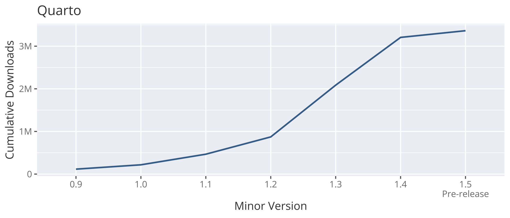

### Shiny

Shiny has been a mainstay in the R community since its launch in 2012,
providing a web application framework that makes it easy to tell data
stories in interactive point-and-click web applications. In April 2023,
Posit released the Python version of Shiny, bringing the same great
reactive programming model and modular design to the PyData ecosystem.

Shiny applications can be shared with others via an open-source [Shiny
Server](https://posit.co/products/open-source/shinyserver/), the hosted
[shinyapps.io](http://shinyapps.io) service, or with [Posit
Connect](https://posit.co/products/enterprise/connect/). Shiny and
related packages include shiny ([Python](https://shiny.posit.co/py/),
[R](https://shiny.posit.co/r/getstarted)),
[bslib](https://rstudio.github.io/bslib/),
[shinytest](https://rstudio.github.io/shinytest/),
[shinyloadtest](https://rstudio.github.io/shinyloadtest/),
[shinydashboard](https://rstudio.github.io/shinydashboard/),
[leaflet](https://rstudio.github.io/leaflet/), and
[crosstalk](https://rstudio.github.io/crosstalk/).

There are 5 FTE Posit employees developing the open-source Shiny and
Shiny Server products as of May 2024.

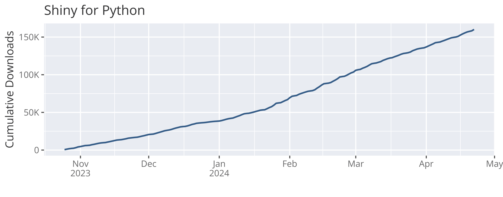

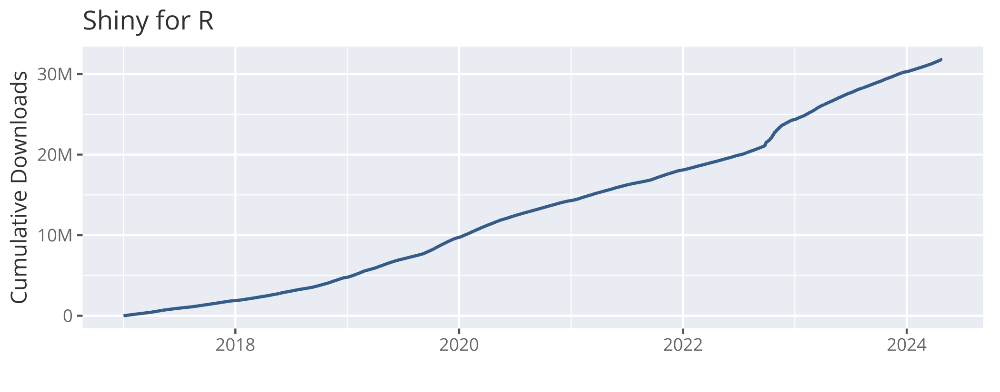



### gt / Great Tables

When presenting an analysis, a table can often convey the results more
concisely than the most beautiful and interactive of charts. However,
the experience of creating and displaying tables in R and Python has
been mixed, especially when you want to display something beyond a plain
data frame representation.

To that end, the [gt](https://gt.rstudio.com/) and [Great
Tables](https://posit-dev.github.io/great-tables/articles/intro.html)
packages have defined a “grammar of tables” to solve this problem (in R
and Python, respectively), analogous to the “grammar of graphics” for
specifying charts.

As of May 2024, there is 1 FTE Posit employee developing gt / Great
Tables open-source packages.

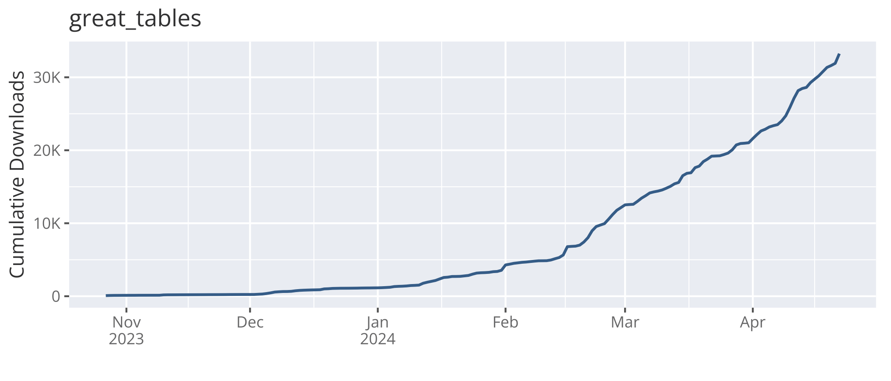

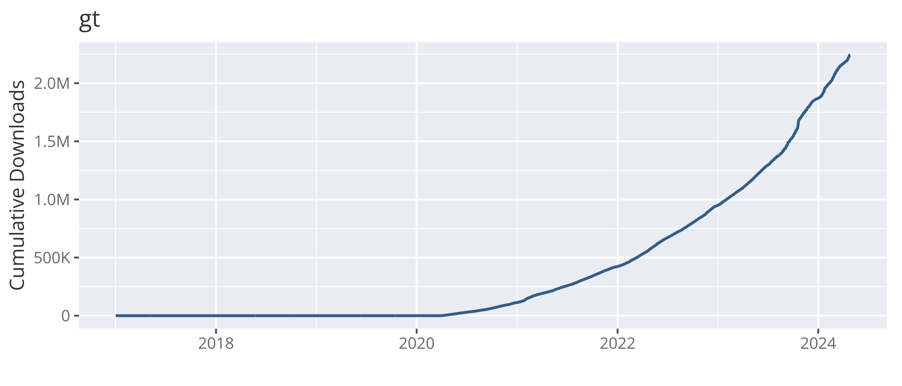

### Vetiver

[Vetiver](https://vetiver.posit.co/) solves the issues around
versioning, sharing, deploying and monitoring predictive models served
via APIs. Available for both R and Python, vetiver is extensible via
generics that support many common types of models. Vetiver also provides
the “model cards” functionality, which can help to generate
documentation by extracting some information about the generated model.

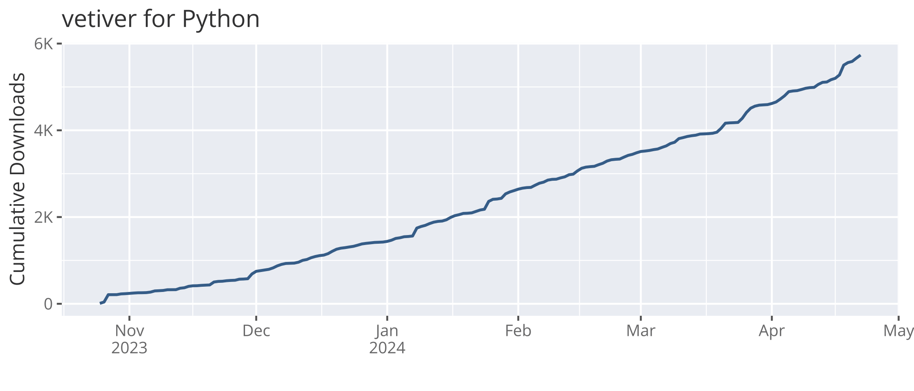

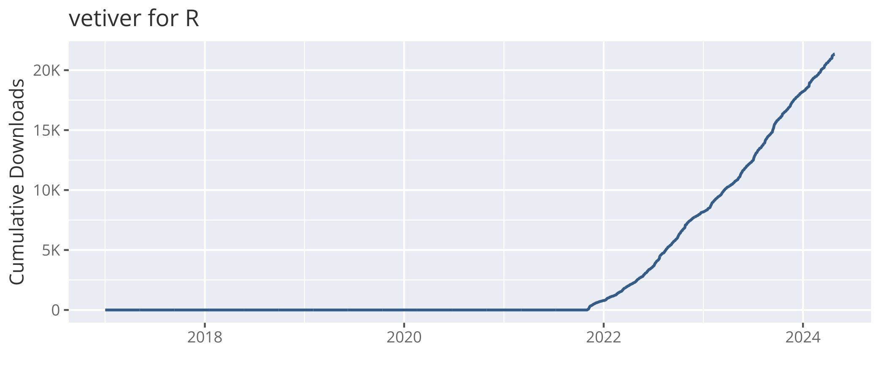

### Posit Public Package Manager

WIth the ubiquity of open source software in our daily lives, one area
that most people don’t think about is ‘How do you distribute that
software quickly and securely to the end user?’. To that end, Posit
created [Posit Package
Manager](https://posit.co/products/enterprise/package-manager/), which
gives companies a means for providing curated repositories, repository
snapshots for better reproducibility, the ability to air-gap the
repository for enhanced security and much more.

As part of our commitment to improving the quality and availability of
open source software for all, Posit hosts a public instance of Posit
Package Manager called [Posit Public Package
Manager](https://packagemanager.posit.co/client/#/) that mirrors CRAN,
PyPI and Bioconductor. This mirror served nearly 40 million downloads
per month in Q1 2024.

### webR

[WebR](https://docs.r-wasm.org/webr/latest/) has the ambitious goal of
bringing the R language to the browser, removing the need for a backend
server for computation. It also allows for computation to be done on the
client machine, supporting use cases that are infeasible or undesirable
for using server-side processing (such as not wanting to send personal
data over the internet). Also, by making the most of the user’s device
capabilities, webR can improve performance and lower app hosting costs.

There is 1 FTE Posit employee developing webR open-source products as of
May 2024.

### Plotnine

[Plotnine](https://plotnine.org/) is an implementation of the grammar of
graphics in Python, heavily influenced by ggplot2 in R. Built upon the
ubiquitous [matplotlib](https://matplotlib.org/) plotting library,
custom (and otherwise complex) plots are easy to reason about and build
incrementally, while the simple plots remain simple to create.

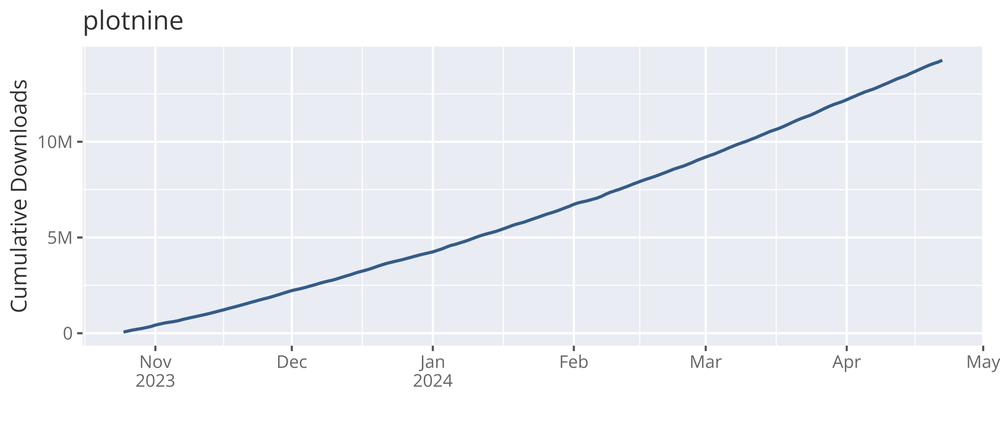

### Siuba

[Siuba](https://siuba.org/) is a port of dplyr and other R libraries.
It’s aim is to make data science faster through a consistent interface
of verbs for working with real-world data: filter, arrange, select,
mutate and summarize. Siuba supports several backends including pandas,
[DuckDB](https://duckdb.org/) and SQL, providing a “write once, run
many” freedom for your analytics code.

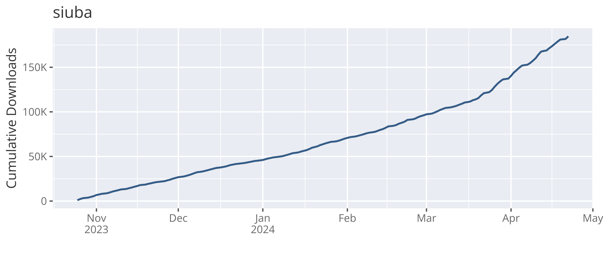

### RStudio Integrated Development Environment

[RStudio](https://posit.co/products/open-source/rstudio/) is a
multi-language IDE designed for Data Science with R and Python. It
augments the standard code console with an editor that can display
Notebooks, launch apps, highlight code syntax, spot code errors, and
directly execute code. Built into the IDE are tools for debugging,
plotting, browsing files, and managing project histories and workspaces.
Together these tools make data scientists and developers much more
efficient.

There are 5 FTE Posit employees developing the RStudio IDE open-source
desktop and server products as of May 2024.

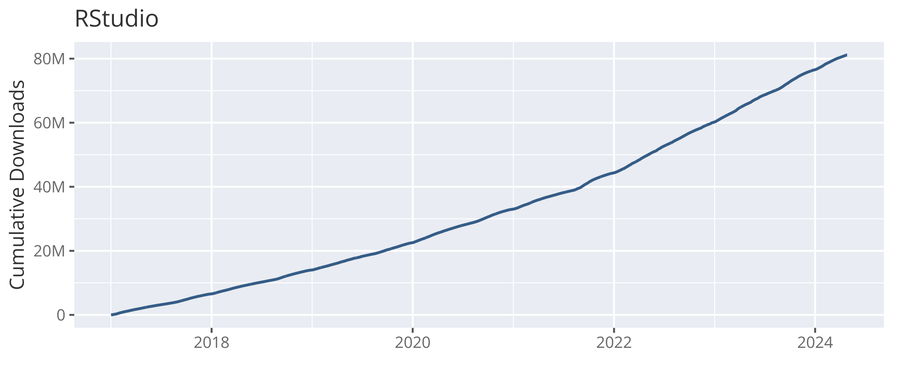

### Tidyverse

The [tidyverse](https://www.tidyverse.org/) is an opinionated collection
of R packages designed for data science. All packages share an
underlying design philosophy, grammar and data structures.

The tidyverse consists of nine core packages (including ggplot2, tidyr
and readr) and 31 packages overall.

There are 9 FTE Posit employees developing Tidyverse and related
open-source products as of May 2024.

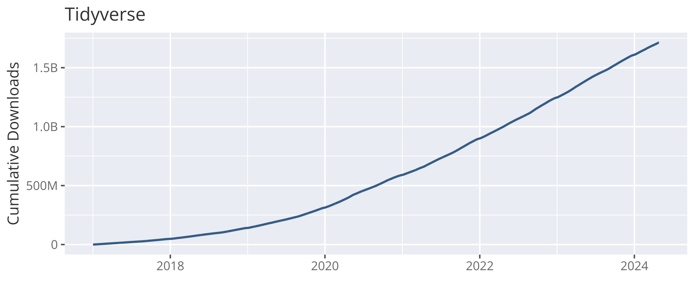

### Tidymodels

[Tidymodels](https://www.tidymodels.org/) is a cohesive collection of
packages that perform tasks relevant to statistical modeling and machine
learning. Tidymodels packages share a common syntax and design
philosophy, and are designed to work seamlessly with Tidyverse packages.

There are currently 42 tidymodels packages on CRAN. Popular tidymodels
packages include parsnip, rsample, recipes, tune and yardstick.

There are 3 FTE Posit employees developing Tidymodels and related
open-source products as of May 2024.

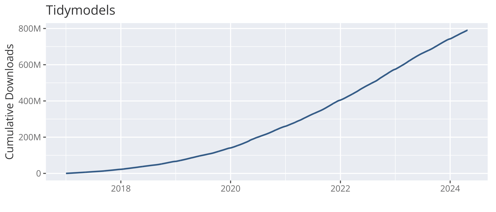

### Connectivity Packages

Posit increases the efficiency of customers by making open-source
packages that connect data scientists to spreadsheets, databases,
distributed storage frameworks for big data, machine learning platforms,
and the programming environments of other languages, like python.

Connectivity packages include: [sparklyr](https://spark.posit.co/),
[tensorflow for R](https://tensorflow.rstudio.com/),
[keras](https://keras.posit.co/),
[odbc](https://solutions.posit.co/connections/db/r-packages/odbc/), and
[reticulate](https://rstudio.github.io/reticulate/).

There are 3 FTE Posit employees creating connectivity-related
open-source packages as of May 2024.

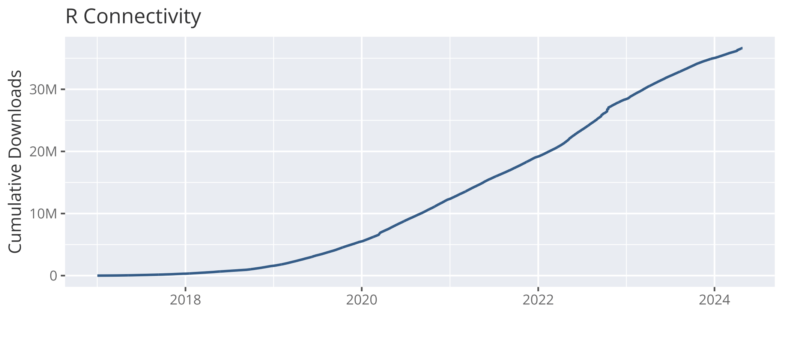

### R Infrastructure Tools (r-lib)

R-lib is a large collection of R packages that make it easier to build,
find, and use effective tools for data analysis.

There are currently 114 R-lib packages. Popular packages include
[devtools](https://devtools.r-lib.org/),
[testthat](https://testthat.r-lib.org/),
[roxygen2](https://roxygen2.r-lib.org/),
[pkgdown](https://pkgdown.r-lib.org/) and
[usethis](https://usethis.r-lib.org/).

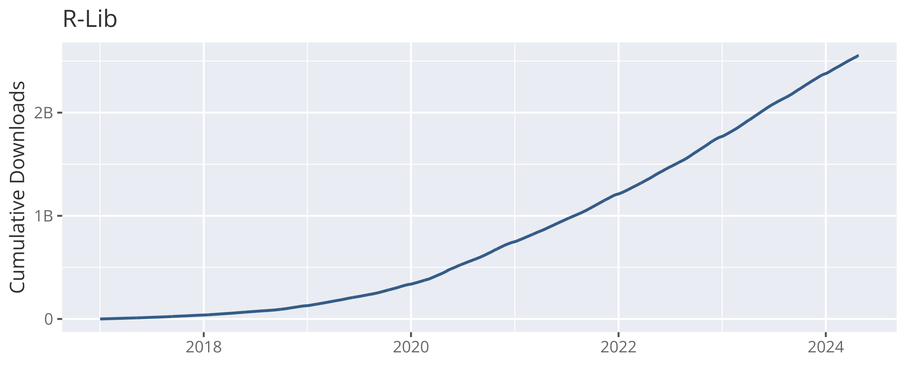

## B Lab® Impact Assessment Results

The BLab Impact Assessment is composed of questions in five Impact
Areas: Governance, Workers, Community, Environment, and Customers.
Posit’s assessment results are available to the public
[here](https://www.bcorporation.net/en-us/find-a-b-corp/company/rstudio/).
We completed our first Impact Assessment in 2019 and earned an overall
score of **86.1.** We are proud to report that our latest score from our
recertification process in 2023, is **92.5**. To put this in context,
the threshold for B Lab certification is a score of 80 or higher, and
the median score for ordinary businesses who take the assessment is
50.9. Posit seeks to continually improve our internal governance,
increase our workforce diversity and employee development efforts,
expand our stewardship of the environment, deepen our engagement in our
communities, and better serve our customers so that our public benefit
will continue to improve each year.

In our initial assessment, we received high marks for incorporating as a
benefit corporation, the health, wellness, safety, and financial
security of our employees, and for educating and serving customers. We
identified formal goal setting, career development, diversity, equity &
inclusion, civic engagement & giving, and air & climate as areas for
improvement.

### Summary of Score Improvements Since 2019

The B Lab’s Impact assessment standards have evolved since 2019 (we are
now on version 6 of the assessment). New questions were added, and
thresholds for performance were raised in other cases. Of the scored
questions we responded to in our most recent assessment, 38 were
unchanged from 2019, 71 were modified from 2019 wording, and 22 were
brand new questions. On the unchanged or modified questions, we have
gained points in the areas listed below.

| **Impact Area** | **Topic** | **% Achievement Gain since 2019** |
|:---|:---|:---|
| Community | Civic Engagement & Giving | 39% |
|  | Diversity, Equity, & Inclusion | 60% |
| Customers | Customer Stewardship | 28% |
| Environment | Air & Climate | 75% |
| Governance | Ethics & Transparency | 37% |
| Workers | Career Development | 62% |
|  | Engagement & Satisfaction | 50% |
|  | Financial Security | 58% |

### Community

#### Civic Engagement and Giving

In addition to the open-source software we make freely available, and
the open source data science package development produced by Posit
engineers, Posit recognizes the importance of contributing financially
to other valuable open-source and community initiatives. To date, Posit
has given over \$1.9M to projects led by others. Current commitments
include contributing to NumFOCUS, the R Consortium, the R Foundation,
DuckDB, the Eclipse Foundation, and the authors and maintainers of
several other open-source projects.

Posit’s financial support also extends beyond the world of open source
data science. Since 2020, Posit and its employees have given over \$60k
to over 135 nonprofits. Our donations reach a range of community-based
causes, including organizations dedicated to racial equality, equal
justice, LGBTQ+ support, and access to education. Alongside our
donations to open source software development, this pool of charitable
contributions contributes to the important work many are doing to
increase the accessibility of data science for all. Our scoring in this
area of the B Lab assessment has increased by 39.5% since 2019.

#### Diversity, Equity, and Inclusion

Since our initial B Lab assessment in 2019, Posit has continued to focus
on increasing the strength of our team by utilizing talent practices
that encourage diverse people to apply, join, and thrive at Posit.
Specific changes made in recent years include the formation of a
diversity, equity, inclusion, and accessibility council (DEIA Council),
as well as the sponsoring of employee resource groups (ERG’s). We report
our progress on our diversity metrics, as defined in the B Lab
Assessment, in each quarter’s board meeting. We also pay close attention
to issues of equity in compensation, hiring and interviewing, and
employee experience. Our efforts to date have yielded increases in the
percentages of women and those with minority racial or ethnic identities
in both management and the employee population as a whole – and our
recent assessment results reflect these gains.

### Customers

We have made meaningful improvements in our care for customers in the
past few years – particularly in our standards for managing customer
data and privacy. Since 2019, we have formalized our approach to data
privacy and compliance – we now conduct thorough internal and external
audits and train all employees on the essentials of guarding customer
data. These changes have increased our assessment performance by 28%
since 2019.

### Environment

We are happy to share that our assessment scores for Air and Climate
impacts have improved by 75% since 2019. In November 2020, Posit
achieved carbon neutrality by purchasing carbon offsets that counter the
environmental impact of business travel (primarily for our annual
conference and internal meetings). As a remote-first organization, we do
not generate meaningful greenhouse gas emissions outside of air travel.
By offsetting this impact through the funding of reforestation work in
both South America and closer to home in Massachusetts, we hope to
neutralize Posit’s potential damage to our planet.

### Governance

A company’s positive governance impact is measured by the extent to
which the company is accountable to stakeholders, and the extent to
which its decision-making is transparent to all constituents. In 2019,
RStudio scored 16.1 points out of a possible 21.9+ points in the
Governance Impact Area, including 10 points awarded for the specific
legal structures we have established as a Benefit Corporation that
preserve our mission and consider our stakeholders regardless of company
ownership.

In our latest assessment, our governance score improved by 37% via
improvements in ethics and transparency areas, including anti-corruption
and code of ethics training for employees, and more rigorous financial
controls and financial transparency with employees. Looking ahead, we
plan to incorporate more social and community benefit metrics in our
corporate reporting, including board meeting updates, so that all of our
stakeholders are aware of our ongoing progress and can help support our
success.

### Workers

We have made significant strides in our Worker assessment category since
2019, with scores increasing by 50% or more in areas such as career
development, engagement and satisfaction, and financial security for our
employees. Investments in employee career development include in-house
management training programs, tooling and education to support
constructive feedback, and documentation of job levels, pay ranges, and
career paths within our major functions. In 2021, we initiated an annual
organizational health survey, which allows us to collect and respond to
employee feedback. We have also augmented our benefits to include a
“lifestyle savings account” (LSA) funded by Posit that each individual
can choose to apply to home office, professional development, wellness,
or financial health expenses as they see fit. All together, we are
working to continuously improve the value offered to our workers as our
company grows.
